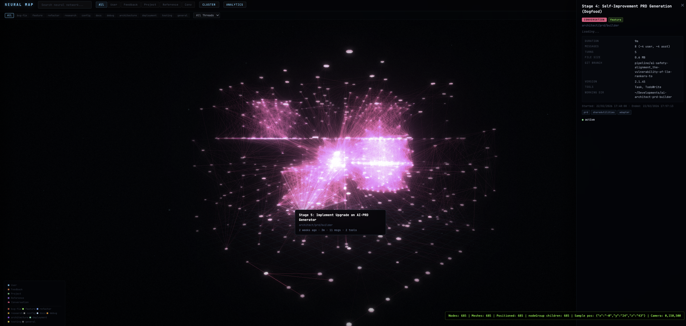

# Memory Monitor

Neural brain map visualization for Claude Code's persistent memory system.

An MCP server that reads your `~/.claude/` memory files and renders them as an interactive 3D neural network in your browser — powered by Three.js with bloom, vignette, synaptic flow particles, and force-directed clustering.



  

## What It Does

- **3D Neural Graph** — Every memory (user preferences, feedback, project context, references) is a glowing node. Connections between related memories appear as synaptic links with animated flow particles.
- **Interactive Exploration** — Click any node to inspect its full content, metadata, tags, and cross-references. Hover to highlight connections. Double-click to reset camera.
- **Filtering** — Filter by memory type (user, feedback, project, reference), category, project, thread, or free-text search across your entire memory graph.
- **Analytics Dashboard** — Activity heatmap, session timeline, category breakdown, top tools, session duration distribution, and project coverage charts.
- **Force-Directed Layout** — Related memories cluster together organically. Toggle between cluster and timeline views.
- **Auto-Rotate** — The brain map slowly orbits when idle, giving that monitoring-room surveillance aesthetic.

## Installation

### Prerequisites

- **Node.js >= 18** (no npm packages needed — zero dependencies)
- **Claude Code** with memory system enabled (`~/.claude/` directory)

### Via Claude Code Marketplace (recommended)

```
/plugin marketplace add cdeust/memory-monitor
/plugin install memory-monitor
```

Restart Claude Code after installation.

### Manual Setup

```bash
git clone https://github.com/cdeust/memory-monitor.git
cd memory-monitor
bash scripts/setup.sh
```

The setup script will:
1. Verify Node.js version
2. Register the MCP server in `~/.claude/mcp_config.json`
3. Symlink the slash command and skill into `~/.claude/`

Then **restart Claude Code** to activate the plugin.

## Usage

### Slash Command

```
/memory-monitor
```

This launches the interactive brain map visualization in your default browser.

### MCP Tools

The MCP server exposes these tools (callable by Claude or via the skill):

| Tool | Description |
|------|-------------|
| `get_memory_graph` | Returns all memories + computed connections as JSON for visualization |
| `get_memory_stats` | Summary counts by type, project, and recency |
| `search_memories` | Full-text search with optional type/project filters |
| `get_memory_detail` | Full content of a single memory by ID |
| `open_visualization` | Launch the brain map in the browser |

### Examples

Ask Claude Code:

- *"Show me my memory graph"* — opens the visualization
- *"How many memories do I have?"* — returns stats
- *"Search my memories for React"* — searches across all memory files
- *"What does my feedback memory about testing say?"* — retrieves specific memory content

## Architecture

```
memory-monitor/
  .claude-plugin/plugin.json   — Plugin manifest
  .mcp.json                    — MCP server config (stdio JSON-RPC 2.0)
  mcp-server/index.js          — Zero-dependency MCP server (Node.js)
  ui/index.html                — Self-contained Three.js visualization (~5000 lines)
  commands/memory-monitor.md   — Slash command definition
  skills/memory-monitor/       — Claude Code skill with tool bindings
  scripts/setup.sh             — One-line installer
```

### How It Works

1. The **MCP server** scans `~/.claude/projects/*/memory/` directories for `.md` files with YAML frontmatter
2. It parses memory type, name, description, and body content from each file
3. It computes **connections** between memories based on shared tags, cross-references, and content similarity
4. The **visualization** receives the graph data and renders it as a Three.js scene with:
   - Icosahedron meshes for memories, hexagonal meshes for conversations
   - Glow halos via sprite textures with additive blending
   - UnrealBloomPass post-processing + vignette + film grain
   - Force-directed 3D layout with project-based clustering
   - Edge flow particles (synaptic pulses) along connections
   - Ambient dust particles for atmosphere

### Memory Types → Node Colors

| Type | Color | Description |
|------|-------|-------------|
| User | Cyan `#00d2ff` | Role, preferences, knowledge |
| Feedback | Orange `#ff6b35` | Corrections and guidance |
| Project | Green `#26de81` | Ongoing work context |
| Reference | Purple `#a55eea` | External resource pointers |
| Conversation | Pink `#ff4081` | Session threads |

## Keyboard Shortcuts

| Key | Action |
|-----|--------|
| `T` | Toggle cluster / timeline layout |
| `A` | Toggle analytics dashboard |
| `Esc` | Close detail panel |
| Scroll | Zoom in/out |
| Drag | Orbit camera |
| Click node | Select and inspect |
| Double-click | Reset camera |

## License

MIT

## Author

[Clement Deust](https://github.com/cdeust)
